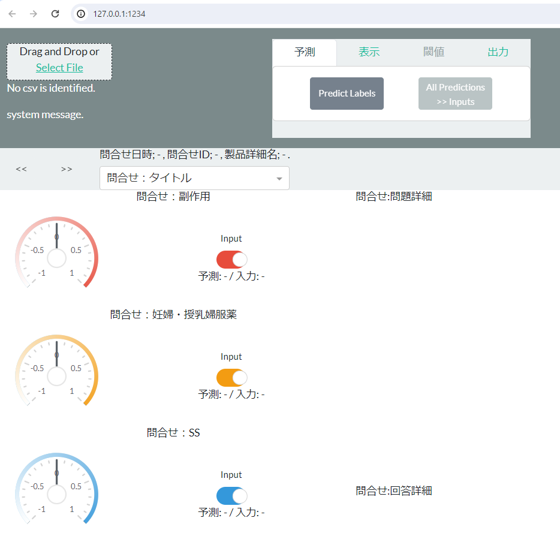

# JP-MedSafetyClassifier

## Overview
**JP-MedSafetyClassifier** is a BERT-based deep learning model developed for the classification of medical safety events in Japanese. It wraps the model in a Dash web application for visualization of output results and assists in file output through user input.  
This product was developed as a joint research project between the Department of Medical Informatics, Osaka University Graduate School of Medicine and the Pharmacovigilance Department and Data Science Department, Drug Development and Regulatory Science Division & DX Promotion Division, Shionogi & Co., Ltd.


## Main Features
The JP-MedSafetyClassifier can classify into three main categories:
1. **Adverse Events**: Positive classification for adverse events caused by the use of a company's pharmaceutical products.
2. **Medications During Pregnancy and Breastfeeding**: Cases involving medication use during pregnancy or nursing. Inquiries about prescriptions without confirmation of administration are classified as negative.
3. **Special Situation (SS)**: Refers to non-standard medical situations, important for clinical aspects or drug safety, recommended for reporting in regulatory guidelines like ICH, FDA, EMA. Includes overdose, drug abuse/misuse, off-label use, occupational exposure, insufficient effect, and administration errors.


## Usage
1. First, download the model (for example, our published model at https://github.com/ShionogiCoLtd/JP-MedSafetyClassifier/releases/tag/model) and save it in the `model` directory.
2. Modify `config.yml` according to your data column names and the location of the pre-trained model.
3. Execute `python ./code/app.py` to launch the Dash web application.
4. Access the application through a browser, for example, at `http://127.0.0.1:1234/`.





```
@InProceedings{Wada2023AdverseEvent,
  author = {Shoya Wada and Masaharu Okamoto and Kento Sugimoto and Yasushi Matsumura and Katsuki Okada and Shirou Manabe and Shozo Konishi and Haruka Sato and Takuya Hara and Genta Ito and Akio Tsuji and Toshihiro Takeda},
  title = {Development of an Adverse Event Extraction and Entry Assistance Tool to Support Regulatory Reporting},
  booktitle = {Proceedings of the 27th Spring Symposium of the Japanese Society for Medical Information},
  year = {2023},
  pages = {56--57},
  address = {Okinawa Convention Center, Ginowan, Okinawa},
  month = jun,
  organization = {Japanese Society for Medical Information},
  note = {Oral presentation at the 27th Spring Symposium of the Japanese Society for Medical Information, June 29 - July 1, 2023, Presentation date: June 30, 2023}
}
```
